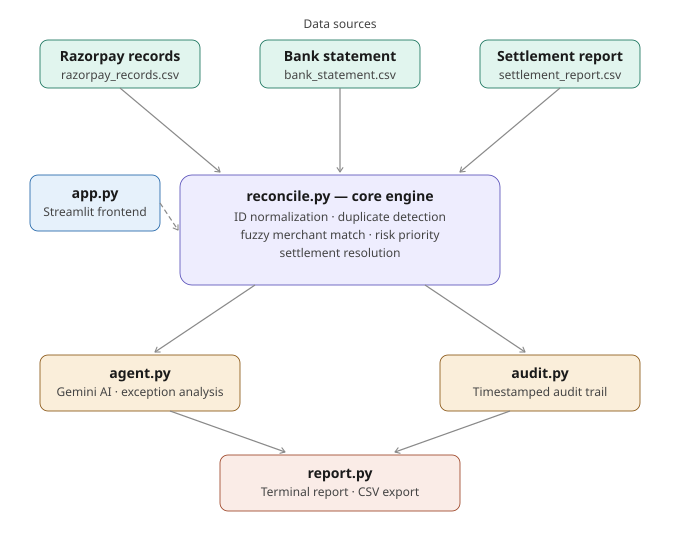

# FinSync — AI-Powered Financial Reconciliation Agent

> Built for Razorpay AI Buildathon 2026 · Track 04: AI Finance Controller

---

## What it does

FinSync automatically reconciles Razorpay payment records against bank statements — catching mismatches, duplicates, and fee discrepancies that would otherwise take a finance team hours to find manually.

It doesn't just match transactions. It **explains exceptions in plain English using AI**, prioritizes them by risk, and gives you a full audit trail of every decision.

---

## The Problem

Every business using Razorpay gets three data sources:
- Razorpay dashboard records
- Bank statement
- Settlement report (with MDR fee deductions)

Reconciling these manually is slow, error-prone, and painful. A ₹1 difference can mean a duplicate charge. A missing transaction can mean fraud. FinSync handles all of this automatically.

---

## Features

| Feature | Details |
|---|---|
| 🔁 Core Reconciliation | Matches Razorpay records to bank transactions by transaction ID |
| 🧹 ID Normalization | `TXN-001`, `txn001`, `TXN001` all treated as the same transaction |
| 🔍 Duplicate Detection | Flags duplicate entries in bank statement before matching |
| ⚖️ Settlement Resolution | Uses settlement report to explain MDR fee deductions — not flagged as mismatches |
| 🧠 Fuzzy Merchant Matching | Catches merchant name typos (e.g. `Swiggy` vs `Swiggy India`) using fuzzy matching |
| 🚨 Risk Prioritization | Exceptions ranked LOW / HIGH / CRITICAL based on amount |
| 🤖 AI Exception Analysis | Gemini explains every unmatched transaction in plain English |
| 📋 Audit Trail | Every decision logged with timestamp and reasoning |
| 📊 Streamlit Dashboard | Upload CSVs, view results visually, download report |

---

## Architecture



---

## Tech Stack

- **Python 3.12**
- **Pandas** — data loading and matching logic
- **google-genai (Gemini)** — AI-powered exception analysis
- **thefuzz** — fuzzy merchant name matching
- **Streamlit** — frontend dashboard
- **python-dotenv** — environment variable management

---

## How to Run

### 1. Clone the repo
```bash
git clone https://github.com/PratheekshaSD/FinSync.git
cd FinSync
```

### 2. Install dependencies
```bash
pip install pandas google-genai thefuzz streamlit python-dotenv
```

### 3. Set up your API key
Create a `.env` file in the root folder:
```
GEMINI_API_KEY=your_key_here
```

### 4. Launch the app
```bash
streamlit run app.py
```

Upload your CSVs in the sidebar and hit **Run Reconciliation**.

---

## Results

Tested on 51 adversarial bank records and 50 Razorpay records with intentional mismatches:

| Metric | Value |
|---|---|
| Total records processed | 51 |
| Matched | 47 |
| Exceptions | 4 |
| **Match rate** | **92.16%** |

Exception types handled:
- `duplicate_in_bank` — same transaction appears twice in bank
- `missing_in_bank` — Razorpay shows payment, bank doesn't
- `extra_in_bank` — bank shows transaction not in Razorpay

---

## Sample Output

**Terminal report** shows matched transactions, exceptions with AI explanations, and risk levels.

**`reconciliation_report.csv`** — downloadable full report with all matched and unmatched records.

**`audit_trail.csv`** — timestamped log of every decision the system made.

---

## Project Structure

```
razorpay-buildathon/
├── app.py                     # Streamlit frontend
├── reconcile.py               # Core reconciliation engine
├── agent.py                   # Gemini AI exception analysis
├── report.py                  # Report generation (terminal + CSV)
├── audit.py                   # Audit trail logging
├── data/
│   ├── razorpay_records.csv   # Razorpay payment data
│   ├── bank_statement.csv     # Bank statement data
│   └── settlement_report.csv  # Settlement + MDR fee data
├── audit_trail.csv            # Generated audit log
├── reconciliation_report.csv  # Generated reconciliation report
├── .env                       # API key (not committed)
└── .gitignore
```

---

## Why FinSync?

Manual reconciliation is:
- **Slow** — hours of spreadsheet work per cycle
- **Error-prone** — humans miss subtle mismatches
- **Opaque** — no clear trail of what was checked and why

FinSync makes it **fast, accurate, and explainable** — with AI that doesn't just flag problems but tells you exactly what happened and why.

---

*Built with 💙 for Razorpay AI Buildathon 2026*